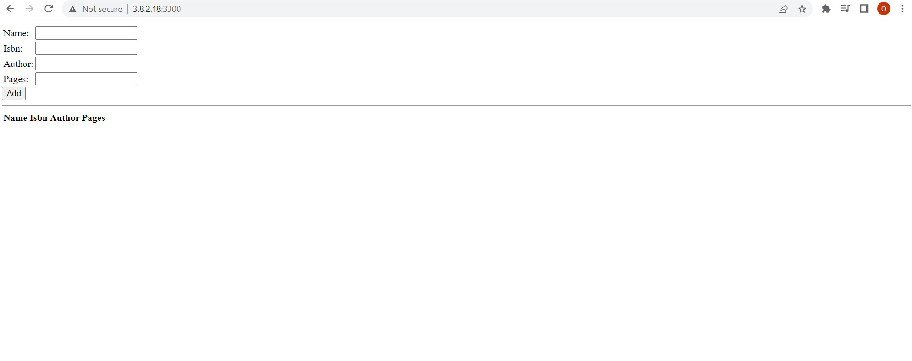

##Mean Stack Deployment to ubuntu in AWS
#update, upgrade and add certificates to ubuntu
`sudo apt update`
`sudo apt upgrade -y`
`sudo apt -y install curl dirmngr apt-transport-https lsb-release ca-certificates curl -sL https://deb.nodesource.com/setup_18.x | sudo -E bash -`

#install NodeJS and confirm version
`sudo apt install -y nodejs`
`node --version`

#install MongoDB
`sudo apt-key adv --keyserver hkp://keyserver.ubuntu.com:80 --recv 0C49F3730359A14518585931BC711F9BA15703C6`
`echo "deb [ arch=amd64 ] https://repo.mongodb.org/apt/ubuntu trusty/mongodb-org/3.4 multiverse" | sudo tee /etc/apt/sources.list.d/mongodb-org-3.4.list`
`sudo apt install -y mongodb`

#start the server and confirm status
`sudo systemctl start mongodb`
`sudo systemctl status mongodb`

#install Node package manager and body-parser package
`sudo apt install -y npm`
`sudo npm install body-parser`

#create Books folder, enter it, inititialize Node package manager and add a file server.js
`mkdir Books && cd Books`
`npm init`

package name booksproject   description A simple book register  entry point server.js   author Darey.io license MIT yes

`ls`

#open server.js, insert code and save
`vi server.js`

var express = require('express');
var bodyParser = require('body-parser');
var app = express();
app.use(express.static(__dirname + '/public'));
app.use(bodyParser.json());
require('./apps/routes')(app);
app.set('port', 3300);
app.listen(app.get('port'), function() {
    console.log('Server up: http://localhost:' + app.get('port'));
});
esc
:wq!

#confirm for errors
`cat server.js`
`ls`

#install express 
`sudo npm install express mongoose`
`ls`
#in Books, create and enter folder apps
`mkdir apps && cd apps`
#create routes.js, open, insert code and save
`touch routes.js`
`ls`
`vi routes.js`

var Book = require('./models/book');
module.exports = function(app) {
  app.get('/book', function(req, res) {
    Book.find({}, function(err, result) {
      if ( err ) throw err;
      res.json(result);
    });
  }); 
  app.post('/book', function(req, res) {
    var book = new Book( {
      name:req.body.name,
      isbn:req.body.isbn,
      author:req.body.author,
      pages:req.body.pages
    });
    book.save(function(err, result) {
      if ( err ) throw err;
      res.json( {
        message:"Successfully added book",
        book:result
      });
    });
  });
  app.delete("/book/:isbn", function(req, res) {
    Book.findOneAndRemove(req.query, function(err, result) {
      if ( err ) throw err;
      res.json( {
        message: "Successfully deleted the book",
        book: result
      });
    });
  });
  var path = require('path');
  app.get('*', function(req, res) {
    res.sendfile(path.join(__dirname + '/public', 'index.html'));
  });
};
esc
:wq!

#confirm for errors
`cat routes.js`

#in apps folder, create and enter models folder
`mkdir models && cd models`
#create a file books.js, open, insert and save code
`touch book.js`
`vi book.js`

var mongoose = require('mongoose');
var dbHost = 'mongodb://localhost:27017/test';
mongoose.connect(dbHost);
mongoose.connection;
mongoose.set('debug', true);
var bookSchema = mongoose.Schema( {
  name: String,
  isbn: {type: String, index: true},
  author: String,
  pages: Number
});
var Book = mongoose.model('Book', bookSchema);
module.exports = mongoose.model('Book', bookSchema);
esc
:wq!

#confirm for errors
`cat book.js`

#change back to Books and create public folder, open, insert and save 
`cd ../..`
`mkdir public`
`cd public`
`vi script.js`

var app = angular.module('myApp', []);
app.controller('myCtrl', function($scope, $http) {
  $http( {
    method: 'GET',
    url: '/book'
  }).then(function successCallback(response) {
    $scope.books = response.data;
  }, function errorCallback(response) {
    console.log('Error: ' + response);
  });
  $scope.del_book = function(book) {
    $http( {
      method: 'DELETE',
      url: '/book/:isbn',
      params: {'isbn': book.isbn}
    }).then(function successCallback(response) {
      console.log(response);
    }, function errorCallback(response) {
      console.log('Error: ' + response);
    });
  };
  $scope.add_book = function() {
    var body = '{ "name": "' + $scope.Name + 
    '", "isbn": "' + $scope.Isbn +
    '", "author": "' + $scope.Author + 
    '", "pages": "' + $scope.Pages + '" }';
    $http({
      method: 'POST',
      url: '/book',
      data: body
    }).then(function successCallback(response) {
      console.log(response);
    }, function errorCallback(response) {
      console.log('Error: ' + response);
    });
  };
});
esc
:wq!

#in the public folder, create index.html, open, insert code and save
`touch index.html`
`vi index.html`

<!doctype html>
<html ng-app="myApp" ng-controller="myCtrl">
  <head>
    
    
  </head>
  <body>
    

      <table>
        <tr>
          <td>Name:</td>
          <td><input type="text" ng-model="Name"></td>
        </tr>
        <tr>
          <td>Isbn:</td>
          <td><input type="text" ng-model="Isbn"></td>
        </tr>
        <tr>
          <td>Author:</td>
          <td><input type="text" ng-model="Author"></td>
        </tr>
        <tr>
          <td>Pages:</td>
          <td><input type="number" ng-model="Pages"></td>
        </tr>
      </table>
      <button ng-click="add_book()">Add</button>
    

    

    

      <table>
        <tr>
          <th>Name</th>
          <th>Isbn</th>
          <th>Author</th>
          <th>Pages</th>

        </tr>
        <tr ng-repeat="book in books">
          <td>{{book.name}}</td>
          <td>{{book.isbn}}</td>
          <td>{{book.author}}</td>
          <td>{{book.pages}}</td>

          <td><input type="button" value="Delete" data-ng-click="del_book(book)"></td>
        </tr>
      </table>
    

  </body>
</html>
esc
:wq!

#confirm for errors and change directory back to Books
`cat index.html`
`cd ..` 

#start server
`node server.js`
seperate `curl -s http://localhost:3300`

